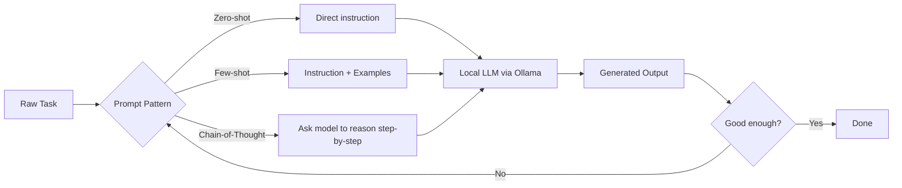
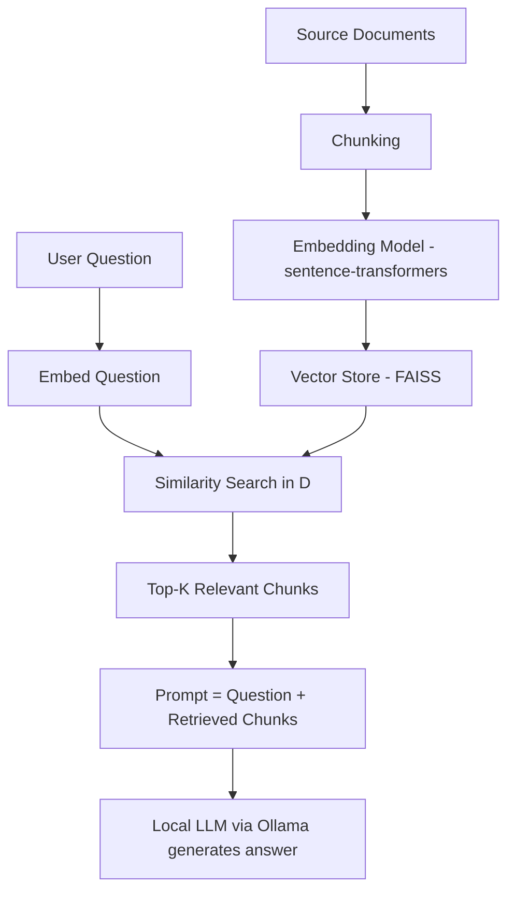
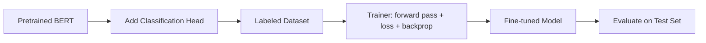

# Hands-On Sessions — Experiments 3, 4 & 5
### No API Key Required — Runs entirely on HuggingFace local models / Ollama


**Key fix for your constraint:** Instead of `openai` / `google-generativeai` (which need paid API keys), every experiment below uses:
- **HuggingFace `transformers`** running open models locally (downloads once, runs offline after) — for embeddings, classification, fine-tuning.
- **Ollama** (optional, recommended for RAG/generation) — runs a real chat LLM (Llama 3.2, Phi-3, Mistral) fully on the participant's laptop, no key, no internet after first pull.
- Fallback: **Google Colab free tier** for anyone whose laptop can't handle local inference.

---

## Setup (do once, before Day covering these experiments)

```bash
python -m venv genai-env
source genai-env/bin/activate      # Windows: genai-env\Scripts\activate

pip install transformers datasets sentence-transformers faiss-cpu \
            accelerate torch scikit-learn pandas langchain langchain-community
```

**Install Ollama** (for Experiments 3 & 4's generation step): https://ollama.com/download
```bash
ollama pull llama3.2:1b      # ~1.3GB, runs on CPU, good for classrooms
# or: ollama pull phi3:mini
```
No sign-up, no API key, no billing — it's a local server at `http://localhost:11434`.

> **If a laptop can't run even the 1B model:** fall back to HuggingFace's `text-generation` pipeline with `distilgpt2` (tiny, CPU-friendly, weaker output but zero setup pain) — code shown as an alternative in each section.

---

## Experiment 3 — Prompt Engineering & Advanced Text Generation
**Duration:** ~90 min | **Maps to:** Unit II — Prompt Engineering, Advanced Text Generation Techniques

### Step 1 — Concept Flow 

Walk through: what changes in the *prompt text itself* between zero-shot, few-shot, and CoT — draw it on the board before opening a laptop.

### Step 2 —  Demo 
```python
import ollama

def ask(prompt, model="llama3.2:1b"):
    response = ollama.chat(model=model, messages=[{"role": "user", "content": prompt}])
    return response["message"]["content"]

# Zero-shot
print(ask("Classify the sentiment of this review as Positive/Negative: 'The plot was dull but the acting saved it.'"))
```

**No-Ollama fallback (pure HuggingFace, no server needed):**
```python
from transformers import pipeline
generator = pipeline("text-generation", model="distilgpt2")
print(generator("Classify the sentiment: The plot was dull but the acting saved it.", max_new_tokens=30))
```

### Step 3 — Now You Try 
Give them this **scaffold** — they fill in the `TODO`s, they don't get the finished version:

```python
import ollama

def ask(prompt, model="llama3.2:1b"):
    # TODO 1: call ollama.chat with the given prompt and return the text
    pass

review = "I expected more from this phone at this price, but the camera is genuinely excellent."

# TODO 2: Write a ZERO-SHOT prompt asking for sentiment (Positive/Negative/Neutral)
zero_shot_prompt = "..."

# TODO 3: Write a FEW-SHOT prompt — include 2 labeled examples before asking about `review`
few_shot_prompt = "..."

# TODO 4: Write a CHAIN-OF-THOUGHT prompt — ask the model to list pros/cons first,
#         THEN give a final verdict
cot_prompt = "..."

for name, p in [("Zero-shot", zero_shot_prompt), ("Few-shot", few_shot_prompt), ("CoT", cot_prompt)]:
    print(f"--- {name} ---")
    print(ask(p))
```

### Step 4 — Checkpoint discussion 
Ask e: did few-shot change the output vs zero-shot? Did CoT catch the mixed sentiment (price complaint + camera praise) that zero-shot missed? This is the "aha" moment for the unit.

---

## Experiment 4 — Building a RAG Pipeline


### Step 1 — Concept Flow (Trainer explains, 15 min)

Emphasize the split: **retrieval is local math (embeddings), generation is the only step touching an LLM** — this is why RAG works fine without a paid API.

### Step 2 —  Demo 
```python
from sentence_transformers import SentenceTransformer
import faiss
import numpy as np
import ollama

docs = [
    "The Eiffel Tower was completed in 1889 for the World's Fair in Paris.",
    "Python was created by Guido van Rossum and released in 1991.",
    "The mitochondria is the powerhouse of the cell.",
]

embedder = SentenceTransformer("all-MiniLM-L6-v2")   # small, local, no key
doc_embeddings = embedder.encode(docs)

index = faiss.IndexFlatL2(doc_embeddings.shape[1])
index.add(np.array(doc_embeddings))

def rag_answer(question, k=1):
    q_emb = embedder.encode([question])
    _, indices = index.search(np.array(q_emb), k)
    context = " ".join([docs[i] for i in indices[0]])
    prompt = f"Answer using only this context:\n{context}\n\nQuestion: {question}"
    return ollama.chat(model="llama3.2:1b", messages=[{"role": "user", "content": prompt}])["message"]["content"]

print(rag_answer("Who created Python?"))
```

### Step 3 — Now You Try 
 build the pipeline on your **own** small document set (give them 5–8 short paragraphs on a topic of choice, e.g., their own company FAQ or a Wikipedia extract):

```python
from sentence_transformers import SentenceTransformer
import faiss
import numpy as np
import ollama

# TODO 1: Paste 5-8 short text chunks about a topic you know (company policy, a hobby, etc.)
docs = [
    "...",
]

# TODO 2: Load the embedding model
embedder = SentenceTransformer("all-MiniLM-L6-v2")

# TODO 3: Encode `docs` into embeddings

# TODO 4: Build a FAISS IndexFlatL2 and add the embeddings to it

def rag_answer(question, k=2):
    # TODO 5: embed the question
    # TODO 6: search the index, get top-k chunk indices
    # TODO 7: join those chunks into a `context` string
    # TODO 8: build the final prompt: "Answer using only this context: {context}\n\nQuestion: {question}"
    # TODO 9: call ollama.chat and return the answer
    pass

# TODO 10: Ask it 3 questions — including one NOT answerable from your docs.
# Observe: does it hallucinate, or say "not in context"? Try fixing the prompt to force honesty.
```

### Step 4 — Checkpoint
 share "not answerable from context" test and what happened — this naturally leads into a discussion of hallucination and prompt-level grounding instructions.

---

## Experiment 5 — Fine-Tuning BERT for Text Classification


### Step 1 — Concept Flow 

Key point to draw out: fine-tuning ≠ training from scratch. BERT already "knows" language; you're only teaching it *this specific task*. This runs on CPU for a small dataset/small epoch count — no GPU or API key needed, just patience.

### Step 2 — Trainer Demo
```python
from datasets import load_dataset
from transformers import AutoTokenizer, AutoModelForSequenceClassification, TrainingArguments, Trainer
import numpy as np
import evaluate

dataset = load_dataset("imdb")
small_train = dataset["train"].shuffle(seed=42).select(range(200))   # small subset for classroom speed
small_test = dataset["test"].shuffle(seed=42).select(range(50))

tokenizer = AutoTokenizer.from_pretrained("bert-base-uncased")

def tokenize(batch):
    return tokenizer(batch["text"], padding="max_length", truncation=True, max_length=128)

train_tok = small_train.map(tokenize, batched=True)
test_tok = small_test.map(tokenize, batched=True)

model = AutoModelForSequenceClassification.from_pretrained("bert-base-uncased", num_labels=2)

accuracy = evaluate.load("accuracy")
def compute_metrics(eval_pred):
    logits, labels = eval_pred
    preds = np.argmax(logits, axis=-1)
    return accuracy.compute(predictions=preds, references=labels)

args = TrainingArguments(
    output_dir="./bert-imdb",
    per_device_train_batch_size=8,
    num_train_epochs=1,
    eval_strategy="epoch",
    logging_steps=10,
)

trainer = Trainer(model=model, args=args, train_dataset=train_tok, eval_dataset=test_tok,
                   compute_metrics=compute_metrics)
trainer.train()
```

### Step 3 — Now You Try 
Scaffold — swap in a different dataset/label set so it's their own experiment, not a copy:

```python
from datasets import load_dataset
from transformers import AutoTokenizer, AutoModelForSequenceClassification, TrainingArguments, Trainer
import numpy as np
import evaluate

# TODO 1: Load a small HuggingFace dataset — try "tweet_eval" (config "sentiment") or "ag_news"
dataset = load_dataset("...", "...")

# TODO 2: Select small train/test subsets (100-300 rows) so training finishes in class time

# TODO 3: Load the bert-base-uncased tokenizer

def tokenize(batch):
    # TODO 4: tokenize batch["text"] with padding/truncation, max_length=128
    pass

# TODO 5: Map tokenize over train/test with batched=True

# TODO 6: Load AutoModelForSequenceClassification with the correct num_labels for your dataset

# TODO 7: Define compute_metrics using the `accuracy` metric

# TODO 8: Set up TrainingArguments (1 epoch, batch size 8, eval each epoch)

# TODO 9: Build the Trainer and call .train()

# TODO 10: Run trainer.evaluate() and note the accuracy. Try predicting on 3 sentences you write yourself.
```

### Step 4 — Checkpoint 
Compare accuracy across tables (different datasets will land differently) — discuss why a 200-row fine-tune isn't production-grade but demonstrates the mechanism. Bridge to CO3 (fine-tuning for classification/generation).

---

## Trainer Notes — Handling the "No API Key" Constraint Across All Three
| Need | Paid-API way (avoided) | Local way used here |
|---|---|---|
| Text generation | OpenAI/Gemini API | Ollama (`llama3.2:1b`) or `transformers` `distilgpt2` |
| Embeddings | OpenAI embeddings API | `sentence-transformers` (`all-MiniLM-L6-v2`) |
| Classification fine-tune | N/A (APIs don't expose this) | `transformers` `Trainer` on `bert-base-uncased` |
| Vector store | Pinecone/managed | `faiss-cpu` (in-memory, local) |

If any laptop truly can't run local inference (very old hardware), try in **Google Colab** notebook link instead (free T4 GPU, same code runs unmodified) as the single fallback — no other API keys needed anywhere in this bootcamp.
